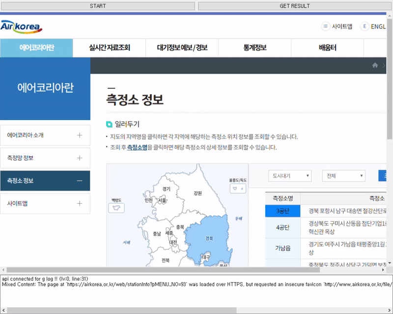

# AirKoreaObservatoryWebCrawler
Crawl Air Quality Observatory Name and Address from AirKorea Webpage.<br><br>
Crawling Demo<br>
<br>

Language
--
Python (Developed and test with version 3.8.5)<br>
JavaScript

Package Requirements
--
```
PyQt5
PyQtWebEngine<=5.15.3
```

Manual
--
### Crawler
```python
from crawl_observatory_location import AirKoreaCrawlerWindow
from PyQt5.QtWidgets import QApplication

app = QApplication(sys.argv)
wnd = AirKoreaCrawlerWindow()
wnd.resize(1000, 800)
wnd.show()
app.exec_()
```
Press 'Start' button to start crawling from AirKorea web-page.<br>
Press 'Get Result' button to serialize crawl result to local file (sqlite) in path {./airkorea_obs_list.db}.<br>

Develop History
--
[웹크롤링 - 한국환경공단(에어코리아) 측정소 정보 가져오기](https://yogyui.tistory.com/entry/%EC%9B%B9%ED%81%AC%EB%A1%A4%EB%A7%81-%ED%95%9C%EA%B5%AD%ED%99%98%EA%B2%BD%EA%B3%B5%EB%8B%A8%EC%97%90%EC%96%B4%EC%BD%94%EB%A6%AC%EC%95%84-%EC%B8%A1%EC%A0%95%EC%86%8C-%EC%A0%95%EB%B3%B4-%EA%B0%80%EC%A0%B8%EC%98%A4%EA%B8%B0) <br>